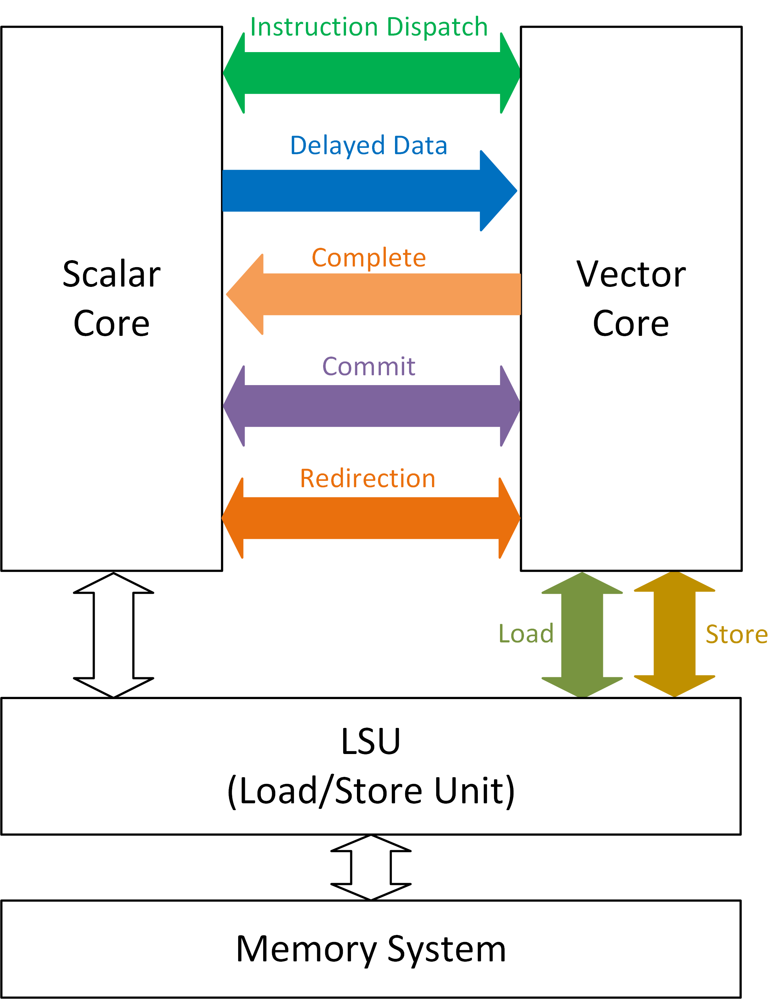

# FVI (Flexible RISC-V Vector Interface)
FVI is a high-performance interface designed to connect a RISC-V vector core with a scalar core. Primarily, it is aimed at schemes involving **out-of-order** vector and scalar cores. However, it is also compatible with in-order architectures.

> Version: 0.1.0 (draft)

The diagram below illustrates all FVI signal groups, as indicated by the colored arrows. FVI operates on the principle that the Load-Store Unit (LSU) manages the load/store operations of both scalar and vector cores.

# List of all interface signals
**Instruction dispatch**
| Name | Direction | Width (bits) | Description |
| --- | --- | --- | --- |
| instr | S -> V | NDispatch x 32 | Vector instructions dispatched from scalar to vector |
| vcsr | S -> V | NDispatch x WVCSR | Some CSR values |
| rob_idx | S -> V | NDispatch x WRobIdx | ROB index of each instruction |
| rob_idx_vsetvl | S -> V | NDispatch x WRobIdx | ROB index of the vsetvl instruction that configures this instruction |
| valid | S -> V | NDispatch | Valid of each instruction |
| ready | V -> S | 1 | Vector core is ready to receive instructions |

**Delayed data**
| Name | Direction | Width (bits) | Description |
| --- | --- | --- | --- |
| vtype | S -> V | 9 | vtype CSR |
| rob_idx_vtype | S -> V | WRobIdx | ROB index of vtype (vsetvl) |
| valid_vtype | S -> V | 1 | Valid of vtype |
| vl | S -> V | WVL | vl CSR |
| rob_idx_vl | S -> V | WRobIdx | ROB index of vl (vsetvl) |
| valid_vl | S -> V | 1 | Valid of vl |
| rs | S -> V | NRs x 64 | Scalar operand that vector instruction needs |
| rob_idx_rs | S -> V | NRs x WRobIdx | ROB index of each scalar operand |
| valid_rs | S -> V | NRs | Valid of each scalar operand |

**Complete**
| Name | Direction | Width (bits) | Description |
| --- | --- | --- | --- |
| rob_idx | V -> S | NComplete x WRobIdx | ROB index of each completed instruction |
| info | V -> S | NComplete x 7 | Information: illegal/fflag/vxsat |
| valid | V -> S | NComplete | Valid of complete instructions |
| rd | V -> S | 64 | Scalar destination register |
| rob_idx_rd | V -> S | WRobIdx | ROB index of rd |
| valid_rd | V -> S | 1 | Valid of rd |

**Commit**
| Name | Direction | Width (bits) | Description |
| --- | --- | --- | --- |
| vec_rob_idx_can_commit | S -> V | WRobIdx | Youngest ROB index of vector instruction that can commit |
| valid_can_commit | S -> V | 1 | Valid of vec_rob_idx_can_commit |
| vec_rob_idx_committed | V -> S | WRobIdx | Youngest ROB index of vector instruction that has committed |
| valid_committed | V -> S | 1 | Valid of vec_rob_idx_committed |

**Redirection**
| Name | Direction | Width (bits) | Description |
| --- | --- | --- | --- |
| vec_rob_idx_redirect_req | S -> V | WRobIdx | Redirection target ROB index of vector instruction |
| valid_redirect_req | S -> V | 1 | Valid of vec_rob_idx_redirect_req |
| vec_rob_idx_redirect_resp | V -> S | WRobIdx | Inform scalar core the completion of vector redirection |
| valid_redirect_resp | V -> S | 1 | Valid of vec_rob_idx_redirect_resp |

**Load**
| Name | Direction | Width (bits) | Description |
| --- | --- | --- | --- |
| sop_ld_req | V -> LSU | 1 | Start of a vector load request packet |
| eop_ld_req | V -> LSU | 1 | End of a vector load request packet |
| valid_ld_req | V -> LSU | 1 | Valid of the payload of the load request packet |
| ready_ld_req | LSU -> V | 1 | LSU is ready to receive the next payload of the request packet |
| payload_ld_req | V -> LSU | WLdPayload | Payload of the request, such as vl, mask, and indexed addresses |
| sop_ld_resp | LSU -> V | 1 | Start of a vector load response packet |
| eop_ld_resp | LSU -> V | 1 | End of a vector load response packet |
| valid_ld_resp | LSU -> V | 1 | Valid of the payload of the load response packet |
| rob_idx_ld_resp | LSU -> V | WRobIdx | ROB index of the response packet |
| data_ld_resp | LSU -> V | VLEN | Load data that corresponds to a single vector register |
| mask_ld_resp | LSU -> V | vlenb | Mask of data_ld_resp |
| reg_idx_ld_resp | LSU -> V | 3 | Index of load register inside the register group|

**Store**
| Name | Direction | Width (bits) | Description |
| --- | --- | --- | --- |
| sop_st_req | V -> LSU | 1 | Start of a vector store request packet |
| eop_st_req | V -> LSU | 1 | End of a vector store request packet |
| valid_st_req | V -> LSU | 1 | Valid of the payload of the store request packet |
| ready_st_req | LSU -> V | 1 | LSU is ready to receive the next payload of the request packet |
| payload_st_req | V -> LSU | WStPayload | Payload of the request, such as vl, mask, and indexed addresses |
| data_st_req | V -> LSU | VLEN | Store data that corresponds to a single vector register |
| reg_idx_st_req | V -> LSU | 3 | Index of store register inside the register group|
| can_commit_st_resp | LSU -> V | 1 | Store instruction can be committed (ordered) |

# Acronym

# Explanation of FVI signals
## (1) Instruction dispatch

The parameter *NDispatch* represents the number of parallel instruction dispatch channels. It defines the upper limit for the number of vector instructions that can be dispatched from the scalar core to the vector core simultaneously.

The *instr* signal denotes vector instructions which are dispatched sequentially from the scalar core to the vector core.

The vcsr signal includes specific CSR values required by the vector core, namely frm, vxrm, and vstart. The width of vcsr, denoted as WVCSR, is log2(VLEN) + 5

| Member of vcsr | Width (bits) | Position |
| --- | --- | --- |
| vstart | log2(VLEN) | vcsr[log2(VLEN)+4 : 5] |
| vxrm | 2 | vcsr[4 : 3] |
| frm | 3 | vcsr[2 : 0] |

The *rob_idx* signal represents the ROB index for each instruction. The ROB, located in the scalar core, is a global buffer that maintains information for all in-flight instructions, both scalar and vector. The width of the rob_idx value is represented by WRobIdx.

The *rob_idx_vsetvl* signal corresponds to the ROB index of the vsetvl instruction that configures the current instruction.

The *valid* signal denotes the validity of dispatched instructions. The count of valid instructions is always less than or equal to NDispatch.

The *ready* signal is an indicator of the vector core's readiness to receive instructions.

Instructions are received from the scalar core by the vector core only when the corresponding valid and ready signals are both set to 1.

## (2) Delayed data

These signals may experience a delay from the corresponding instruction dispatch as they may not be initially available.

The vtype signal contains the values of the vtype CSR, as illustrated below.
| Member of vtype | Width (bits) | Position |
| --- | --- | --- |
| vill | 1 | vtype[8] |
| vma | 1 | vtype[7] |
| vta | 1 | vtype[6] |
| vsew | 3 | vtype[5 : 3] |
| vlmul | 3 | vtype[2 : 0] |

The *rob_idx_vtype* signal represents the ROB index of the vsetvl instruction that produces this vtype.

The *vl* signal corresponds to the value of the vl CSR. *WVL*, the width of vl, is equivalent to log2(VLEN)+1.

The *rs* signal encompasses the scalar operands required by the vector instruction. The parameter *NRs* determines the number of scalar operands that can be transferred concurrently.

> Note: the vector load/store instruction does not require the *rs* signal.

## (3) Complete
| Name | Direction | Width (bits) | Description |
| --- | --- | --- | --- |
| rob_idx | V -> S | NComplete x WRobIdx | ROB index of each completed instruction |
| info_wb | V -> S | NComplete x 7 | Write-back information: illegal/fflag/vxsat |
| valid | V -> S | NComplete | Valid of complete instructions |
| rd | V -> S | 64 | Scalar destination register |
| rob_idx_rd | V -> S | WRobIdx | ROB index of rd |
| valid_rd | V -> S | 1 | Valid of rd |

"Complete" signals denote instructions that have been executed in the vector core.

The *rob_idx* signal represents ROB indices of completed vector instructions. The parameter *NComplete* denotes the number of completed instructions that can be concurrently sent from the vector to the scalar core.

The *info_wb* signal that corresponds to the *rob_idx* comprises the following signals.
| Member of info_wb | Width (bits) | Position |
| --- | --- | --- |
| vxsat | 1 | info_wb[6] |
| fflag | 5 | info_wb[5 : 1] |
| illegal | 1 | info_wb[0] |

The *rd* signal is the value of scalar destination register produced by the vector instruction.

# Todo
Variable parameters:
NDispatch
rob_idx/rob_idx_vsetvl can be NDelayRobIdx later. NDelayRobIdx should be constant.

nested redirection

sop_ld_req: 1) allocate phy reg 2) wait for old_vd if needed